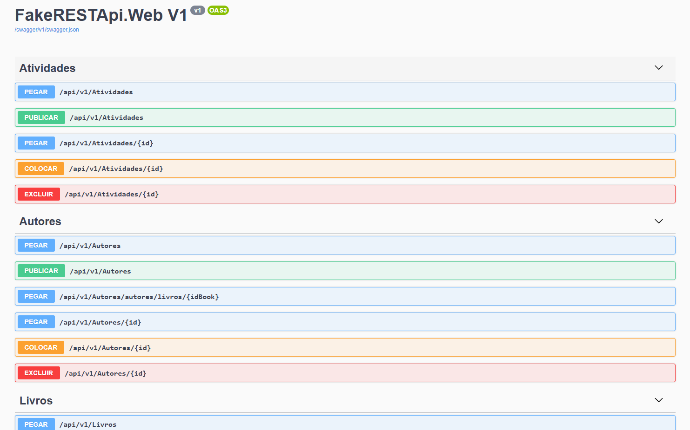

# Projeto de Testes da API FakeRESTApi

Este repositório documenta o conjunto de testes realizados na API [FakeRESTApi](https://fakerestapi.azurewebsites.net/index.html), uma plataforma que simula operações RESTful para fins de desenvolvimento e validação de APIs. O objetivo principal deste projeto foi garantir que os endpoints da API funcionassem conforme o esperado, validando as respostas, os parâmetros de consulta e a consistência dos dados retornados. Dessa forma, estabeleci uma base confiável para desenvolvedores testarem suas próprias implementações de APIs.

## Detalhes do Teste

### Requisições GET para Listagem e Consulta de Livros

- **Listar Todos os Livros:** Realizei requisições para o endpoint `/api/v1/Books` para verificar o retorno de uma lista completa de livros. Validei que a resposta incluía o status 200 e continha os detalhes completos de cada livro.
- **Consulta de Livro Específico:** Testei o endpoint `/api/v1/Books/1` para obter informações de um livro específico. A resposta retornou status 200 e os dados completos do livro com o ID especificado.

### Requisição POST para Criação de Livros

- **Criação de Novo Livro:** Testei o endpoint `/api/v1/Books` enviando uma requisição com título e descrição de um novo livro. A API respondeu com status 201, indicando criação bem-sucedida, e retornou os dados do livro criado, incluindo ID, título e descrição.

### Exemplo de Casos de Teste

- **Lista Completa de Livros com Sucesso:** A API retornou status 200 com a lista completa de livros, validando a resposta esperada.
- **Consulta de Livro com Parâmetro Inválido:** Enviei parâmetros inválidos, como um ID inexistente. A expectativa era um erro 400, mas em alguns casos a API retornou status 500, indicando uma possível falha no tratamento de erros. Esse comportamento foi documentado como bug.

## Ferramentas Utilizadas

- **Postman:** Utilizado para criar e enviar requisições para a API, analisando as respostas e o comportamento em diferentes cenários.
- **JIRA:** Ferramenta utilizada para documentar e rastrear os bugs encontrados durante os testes, garantindo que as falhas fossem corrigidas antes da implementação final.

## Conclusão

Este projeto de testes da API **FakeRESTApi** destaca a robustez e confiabilidade dos endpoints simulados para operações CRUD. A execução de testes abrangentes assegura que os requisitos de API ofereçam uma base sólida para desenvolvedores verificarem implementações de APIs, com respostas consistentes e aderentes aos padrões de qualidade esperados.
